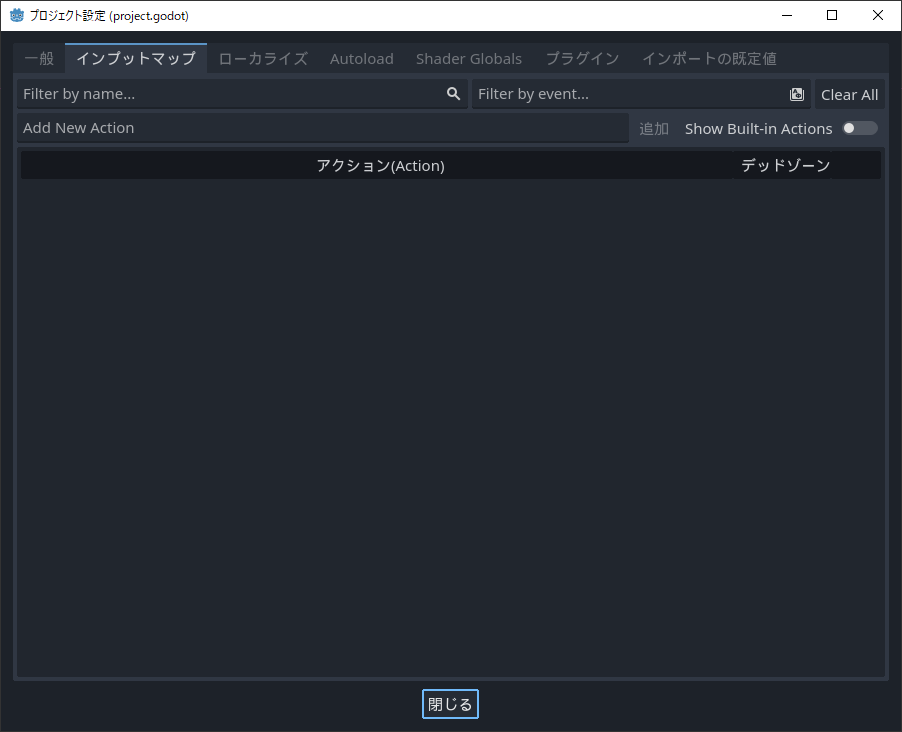
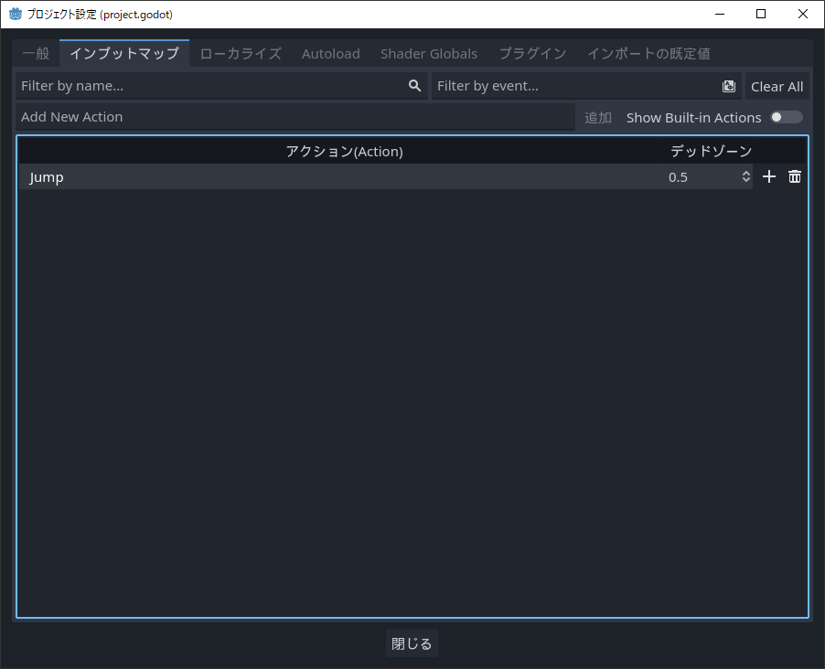
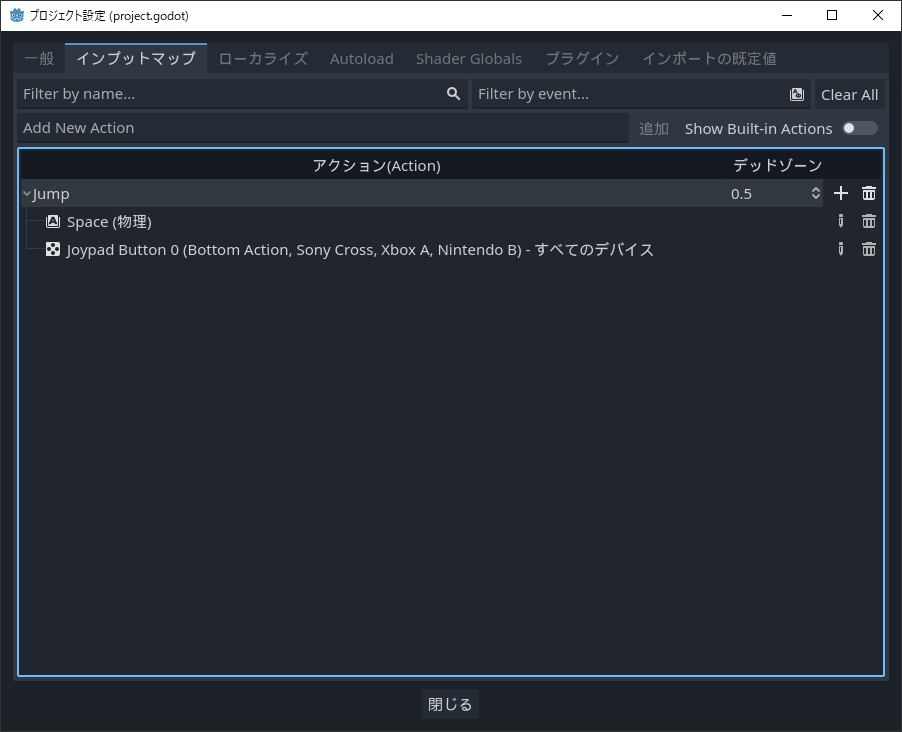

# プロジェクトの入力マップ設定

Godot Engineは`インプットマップ`としてプロジェクト毎に入力の管理ができます。
インプットマップは、**アクション名を設定し、そのアクションに、どの入力を割り当てるか**という考え方になります。

## デバイスからの入力を設定する

`プロジェクト設定`から`インプットマップ`タブを開きます。
デフォルトで設定されているアクションは非表示になっています。



### アクション名の設定


`インプットマップ`タブの上部にあるテキストボックスに、アクション名を入力して「追加」ボタンを押します。
今回は`Jump`と入力しました。

`アクション（Action）`のリストの中に、作成した`Jump`が登録されます。


#### アクションに入力を設定する



設定したアクションの項目の右側の「＋」ボタンを押します。

キーを設定する`Event Configuration`ウィンドウがポップアップします。
このウィンドウが開いた状態で、キーボードのキーやゲームパッドのボタンを押すと自動的に入力されます。


ウィンドウ中央のリストから、マウス・キーボード・ゲームパッドなどのボタンを選択することも可能です。

例えば、マウスはこのウィンドウの設定に使用するため、自動での入力は反応しないため、リストから選択する必要があります。
開発段階でゲームパッドがつながっていなくても、リストから選択することで設定自体は可能です。



一つのアクションに対して複数の入力を割り当てる事が可能なため、キーボードとゲームパッドの両方で対応する場合も、アクション名を参照することで、設定されたすべての入力の状態を調べることができます。

すべてのアクションの登録が終わったら、プロジェクト設定ウィンドウを閉じます。


### デッドゾーンについて

キーボードやマウスと異なり、ゲームパッドはスティックのアナログ入力があります。

アナログ入力の利点は、スティックを倒す量を`0.0~1.0`の値で表現し、操作性が柔軟になることです。

欠点は、デッドゾーンを設定しない場合、スティックの値が安定しないことです。
これは物理的なスティックの倒す量を取っている事から、ブレが発生するためです。

例えばデッドゾーンを`0.2`に設定すると、`0.2`未満の値はすべて`0`とみなされます。
これにより、不安定なアナログ入力のブレを制限することができます。


# 基本的な入力の取得方法

プロジェクトにアクションマップが登録されたので、実際に入力を処理するサンプルを記載します。

## インプットメソッドで入力を処理する

```gdscript
func _input(_event):
    if _event.is_action_just_pressed("Jump"):
        print("ジャンプボタンが押された")
```

## プロセスメソッドで入力を処理する

```gdscript
func _proccess(_delta):
    if Input.is_action_just_pressed("Jump"):
        print("ジャンプボタンが押された")
```

### InputEventの種類

|イベント名|型インデックス|説明|
|---|---|---|
|InputEvent              |NONE            |空の入力イベント|
|InputEventKey           |KEY             |スキャンコードとUnicodeの値、および修飾子が含まれています。|
|InputEventMouseButton   |MOUSE_BUTTON    |ボタン、モディファイヤなどのクリック情報が含まれます。|
|InputEventMouseMotion   |MOUSE_MOTION    |相対位置、絶対位置、速度などのモーション情報が含まれます。|
|InputEventJoypadMotion  |JOYSTICK_MOTION |ジョイスティック/ジョイパッドのアナログ軸情報が含まれています。|
|InputEventJoypadButton  |JOYSTICK_BUTTON |ジョイスティック/ジョイパッドのボタン情報が含まれます。|
|InputEventScreenTouch   |SCREEN_TOUCH    |マルチタッチのプレス/リリース情報が含まれています。(モバイルデバイスでのみ使用可能)|
|InputEventScreenDrag    |SCREEN_DRAG     |マルチタッチドラッグ情報が含まれています。(モバイルデバイスでのみ使用可能)|
|InputEventScreenAction  |SCREEN_ACTION   |汎用アクションが含まれています。これらのイベントは多くの場合、フィードバックとしてプログラマーによって生成されます。(詳細は以下)|